# 多模态AI文献与图像管理助手

一个基于人工智能的多模态文档和图像管理系统，支持智能分类、语义搜索和跨模态检索功能。

## 🌟 核心功能

### 文献管理
- **智能分类**: 自动将PDF论文分类到CV、NLP、RL等学术领域
- **语义搜索**: 基于自然语言的智能文档搜索
- **批量处理**: 支持批量导入和整理论文库
- **相关片段提取**: 搜索时自动提取最相关的文本片段

### 图像管理
- **以文搜图**: 使用文本描述搜索相似图像
- **多模型支持**: 支持CLIP、ResNet等多种图像嵌入模型
- **批量导入**: 一键导入整个图像文件夹

### 系统管理
- **向量数据库**: 使用ChromaDB进行高效的相似性搜索
- **多模态支持**: 文本和图像的统一管理界面
- **统计信息**: 详细的系统使用统计和存储信息

## 🛠 环境配置

### 系统要求
- Python 3.10+
- CUDA 11.3+ (GPU加速推荐)
- 至少4GB可用存储空间

### 快速安装

#### 创建conda环境

```bash
conda create -n multimodal-ai-manager python=3.12 -y
conda activate multimodal-ai-manager
```

#### 安装PyTorch和相关依赖

```bash
conda install pytorch torchvision torchaudio cudatoolkit=11.3 -c pytorch
conda install pillow numpy requests -c conda-forge
```

#### 安装项目依赖

```bash
pip install sentence-transformers openai-clip chromadb pypdf2 python-dotenv
```

或者使用requirements.txt：

```bash
pip install -r requirements.txt
```


#### 配置API密钥
在config.py中设置DeepSeek API密钥：
```python
DEEPSEEK_API_KEY = "your-api-key-here"
# 如有需要，可以配置其他的模型
```


## 📖 详细使用说明

### 1、文献管理

#### 添加新论文并自动分类
```bash
python main.py add_document "test_papers/Attention Is All You Need.pdf"
```
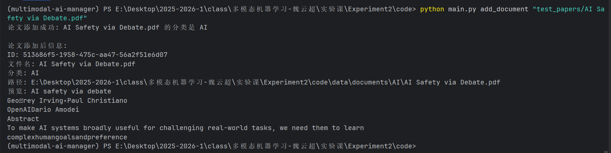

#### 详细搜索论文（显示相关片段和相似度）

```bash
python main.py search_document "machine learning"
```
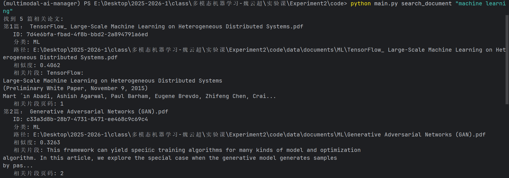

#### 简单列表搜索

```bash
python main.py search_document "transformer structure" --simple
```


#### 批量添加论文（批量整理整个文件夹）

```bash
python main.py organize_documents "test_papers"
```

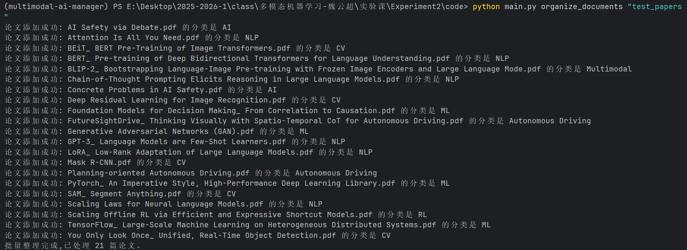

#### 列出所有论文

```bash
python main.py list_documents
```
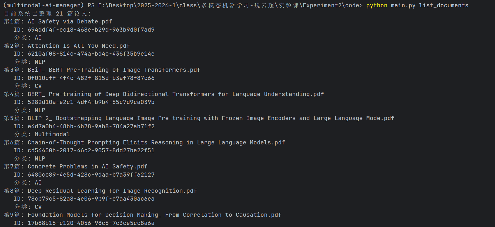


#### 删除论文

#### 通过文件名删除

```bash
python main.py delete_document "AI Safety via Debate.pdf"
```

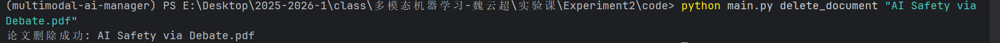
#### 通过ID删除
```bash
python main.py delete_document "da9a49e8-abe9-409e-a7b6-cd3e3f8d2fc6"
```

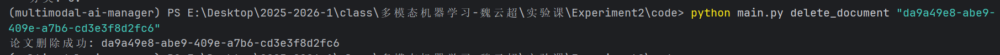

### 2、图像管理

#### 添加单张图像

```bash
python main.py add_image "test_images/daily_family_dinner_table_2.jpg"
```
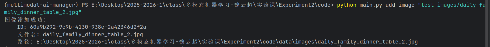

#### 批量添加图像

```bash
python main.py batch_add_images "test_images"
```
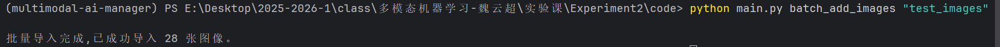

#### 以文搜图

```bash
python main.py search_image "女人和小孩"
```
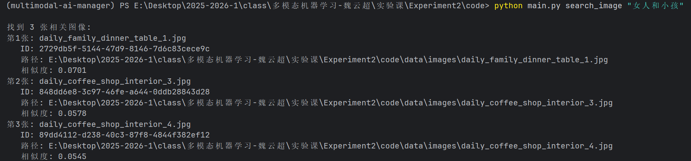

#### 列出所有图像

```bash
python main.py list_images
```
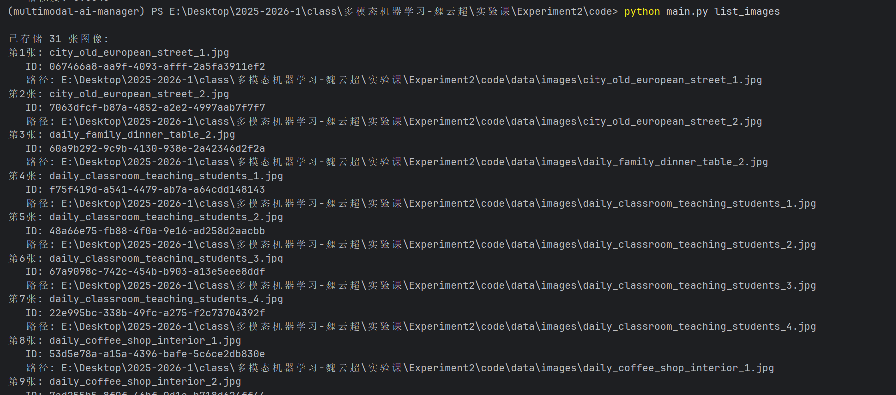

#### 删除图像

```bash
python main.py delete_image "city_old_european_street_1.jpg"
```
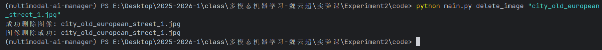

### 3、系统管理

#### 查看系统信息

```bash
python main.py info
```
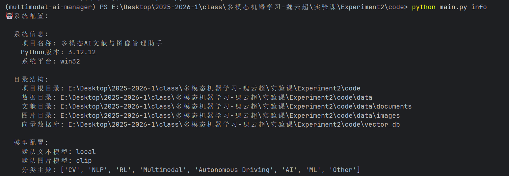


#### 格式化系统（清空所有数据）

```bash
python main.py format
```
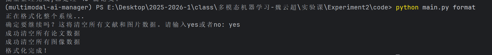

#### 获取帮助

```bash
# 系统帮助
python main.py --help
# 具体命令帮助
python main.py add_document --help
```
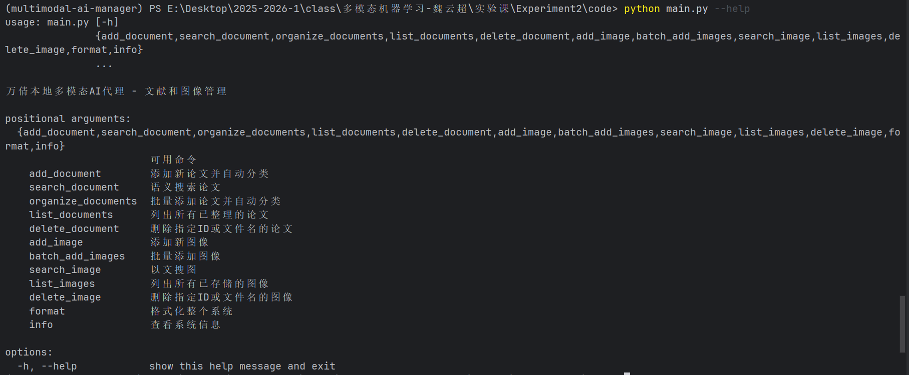
具体命令帮助示例如下：
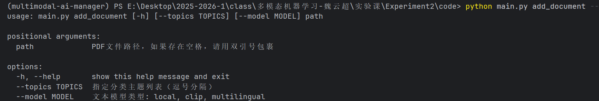
## 🔧 技术选型

### 文本处理模型
- **Sentence Transformers**: 
  - `all-MiniLM-L6-v2` (384维，默认)
  - `paraphrase-multilingual-MiniLM-L12-v2` (多语言支持)
- **CLIP文本编码器**: 512维文本嵌入

### 图像处理模型
- **CLIP ViT-B/32**: 512维图像嵌入，支持图文跨模态
- **ResNet50**: 1000维图像特征，适合分类任务

### 向量数据库
- **ChromaDB**: 轻量级向量数据库，支持余弦相似度搜索

### 分类算法
- **AI分类**: 集成DeepSeek API进行智能分类
- **关键词匹配**: 基于领域关键词的降级分类方案

## 📁 项目结构

```
multimodal-ai-manager/
├── main.py                # 主程序入口
├── config.py              # 配置文件
├── ai_client.py           # AI客户端封装
├── document_manager.py    # 文献管理模块
├── image_manager.py       # 图像管理模块
├── vector_db.py           # 向量数据库模块
├── requirements.txt       # 依赖列表
├── data/                  # 数据存储目录
│   ├── documents/         # 分类后的论文(内类CV、NLP、ML、DL等分类文件夹)
│   └── images/           # 图像文件
├── vector_db/            # 向量数据库文件
├── test_images/          # 测试图片样本
├── 多模态AI文献图片管理-演示视频.mp4          # 演示视频
└── test_papers/          # 测试论文样本
```

## 🚀 性能特点

- **高效检索**: 基于向量的相似度搜索，毫秒级响应
- **智能分类**: 结合AI和关键词的多层次分类策略
- **扩展性强**: 模块化设计，易于添加新模型和功能

## 🤝 贡献指南

欢迎提交Issue和Pull Request来改进这个项目！
